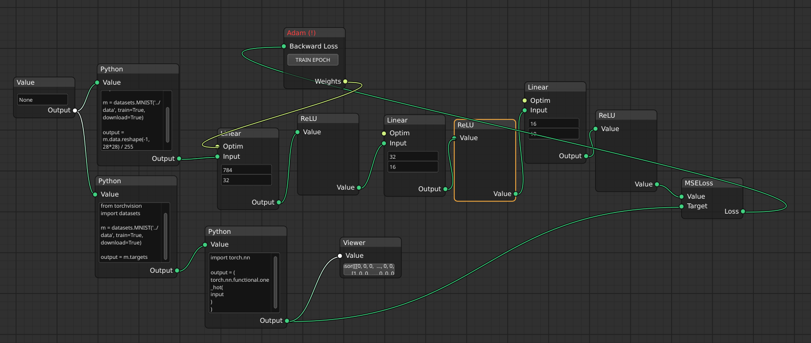

# traiNNer

An application that lets you create neural nets (and other arbritary python code) visually, similar to blender's node systems.

## Features

* Basic python nodes, with operations
* Pytorch-based nodes
* Pytorch optimizers and control flow
* Extensible, easy to implement new nodes

## Todo:

~~* Save/Load files~~
* easier / more convinent dataloaders (or similar)

## Installation and Usage:

`$ git clone https://github.com/zyugyzarc/traiNNer`  
`$ pip install -r requirements.txt` (Note: pytorch nodes depends on torch, see <https://pytorch.org/get-started/locally>)

To execute,  
`$ python3 main.py`

#### Shortcuts:

`Ctrl+S`: Save

`Ctrl+O`: Open file

`Ctrl+A`: Add Node
